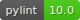

## Python Project Template





### 1. Description

### 2. Installation
```shell
# Install poetry dependencies
poetry install --all-extras --with dev --no-root

# Install pre-commit hooks
poetry run task install_hooks
```

### 3. Local Run
```shell
cd projectname
python run_project.py
```
