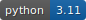
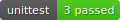
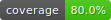
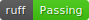
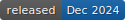

## Python Project Template







### 1. Description
A repository template for python projects.

It contains:
- a `pyproject.toml` setup for uv
- `README.md` and `CHANGELOG.md` documents
- [ruff](https://docs.astral.sh/ruff/) for linting and formatting (plus config stored in `pyproject.toml`)
- [detect-secrets](https://pypi.org/project/detect-secrets/) to audit potential secrets in the repository
- a pre-populated `.gitignore` file for common files in the python ecosystem
- pre-commit hooks for:
  - ruff linting
  - ruff formatting
  - detect-secrets
- uv tasks to run unit tests, test coverage, ruff linting + formatting, and `README.md` badge generation
- a GitHub pull request template
- GitHub actions workflows which:
  - install uv, install project dependencies then run the `tests` task, which includes unit tests, test coverage, ruff linting, ruff formatting and project badges (including committing updates to badges back to the target branch)
  - create a git tag and a corresponding GitHub Release when merging to the `main` branch

### 2. Installation

#### 2.1 Pre-Requisites
This project template uses [uv](https://docs.astral.sh/uv/) for package and project management. 

```shell
# Install dependencies using uv
uv sync --all-extras --dev

# Install pre-commit hooks
uv run task install-hooks

# View other uv tasks
uv run task --list
```

### 3. Local Run
```shell
cd projectname
python run_project.py
```
